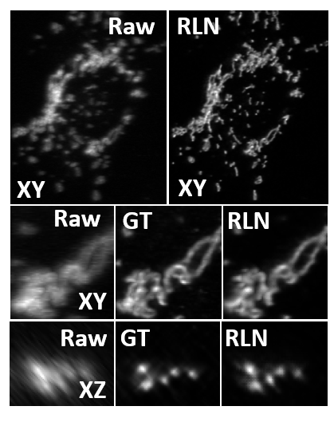

# A deeplearning network based on Richardson-Lucy formula (Richardson-Lucy network, RLN)

RLN is the companion code to our paper:

[Incorporating the image formation process into deep learning improves network performance in deconvolution applications](https://www.biorxiv.org/content/10.1101/2022.03.05.483139v1).

RLN is a 3D fully convolutional deep learning incorporating the Richardson-Lucy deconvolution formula to restore and enhance the resolution of fluorescence microscopy image.

## System Requirements

- Ubuntu 16.04.
- Python 3.6+
- NVIDIA GPU
- CUDA 10.1.243 and cuDNN 7.6.4
- Tensorflow 1.14.0

Tested Environment:

single-view RLN (for single GPU with 24 GB):
    - RLN model (./Test_model_based_on_data)
    - Ubuntu 16.04
    - Python 3.6
    - NVIDIA TITAN RTX 24GB
    - CUDA 10.0 and cuDNN 7.6.4
    - Tensorflow 1.14.0
    
## Dependencies Installation
If using conda, conda install tifffile -c conda-forge.
Otherwise, pip install tifffile.
RLN itself does not require installation, please just download the code and only takes few seconds on a typical PC.
Maybe you need to install numpy, tifffile and other package.
    

## Dataset

We upload a U2OS mitochondria dataset for testing (./RLN_data)

## Training

Before you train a RLN model, we reconmmend you to create the folders as follow:

    Main folder (rename as you like):
      -- train
            --input
            --(input2) for dual-input mode
            --ground truth
            --model_rl
            --output_rl
            --labels.txt (containing the input raw name)
      -- test
            --input
            --(input2) for dual-input mode
            --(ground truth) for validation
            --output_rl
            --labels.txt

We put the RLN code in the (RLN code). There are configuration for single-input RLN and dual-input RLN. 

makedata3D_train_single.py and makedata3D_train_dual.py are the data loading and preprocessing files for single-input and dual-input training respectively.
makedata3D_test_single.py and makedata3D_test_dual.py are the data loading and preprocessing files for single-input and dual-input testing respectively.

After preparing the dataset and relative folders, you can set the main parameters for train in the RLN-single.py or RLN-dual.py:

mode: TR:train ; VL:validation, with known ground truth ; TS: test , no ground truth; TSS: test and with stitch (only in RLN-single)
relative folders:
data_dir = '/home/liyue/newdata1/' # the main folder including the train and test folders
model_path='/home/liyue/newdata1/train/model_rl/new_single_used/' #the folder for the trained model to be saved
train_output='/home/liyue/newdata1/train/output_rl/' #the train output saved folder
test_output='/home/liyue/newdata1/test/output_rl/' # the validating output or testing output folders

train_iter_num=iter_per_epoch*epochs
test_iter_num=testing_data_numbers
train_batch_size=as you want
test_batch_size=1

crop_data_size=365  is the maximum data size for cropping and stitching.
normal_pmin=0.01   is the minimum percentage for normalize
normal_pmax=99.9   is the maximum percentage for normalize

and you can set the learning rate in:
self.learning_rate = tf.train.exponential_decay(0.02,self.global_step,1000,0.9,staircase=False)

After you setting these parameters, you can run: python RLN-single.py or python RLN-dual.py

During training, put training dataset into the input folder and ground truth folder, each input/ground truth (input2) image pair share the same file name. Labels.txt summary the name of all the image pairs. model_rl folder is used to save the trained model. The output_rl model is used to save the output during training, this is not necessary and just to supervise the training procedure.

For 200 epochs with 100 iteration/epoch, it cost 2-3 hours to train the model.

## Model Apply

During testing, put testing dataset into the input folder and list the testing data name into the labels.txt. The output_rl model is used to save the test result. If you have ground truth, you can try validation to metric the difference between the output and ground truth.

You need to set the following parameters:
mode
model_path
test_output
test_iter_num=testing_data_numbers
normal_pmin=0.01   is the minimum percentage for normalize
normal_pmax=99.9   is the maximum percentage for normalize

After you setting these parameters, you can run: python RLN-single.py or python RLN-dual.py

## License

Copyright © 2021 [SVision Technologies LLC.](https://www.aivia-software.com/)

Released under Creative Commons Attribution-NonCommercial 4.0 International Public License ([CC BY-NC 4.0](https://creativecommons.org/licenses/by-nc/4.0/))
